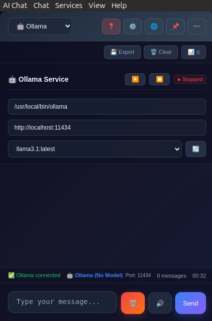

# AI Chat Overlay for Ubuntu - Enhanced Edition

A modern, draggable, always-on-top desktop overlay for chatting with local AI models (Ollama, Llama.cpp) and TTS (Coqui-TTS). Features beautiful dark mode design, accordion minimize, and extensive customization.

```
NOTE:
There is a lot of functionality still missing from this app, but I hope to continue adding to it as I use it.
```

## ✨ Features

<div align="center">



</div>

### 🎨 **Modern Dark Mode Design**
- Sleek gradient backgrounds and glass morphism effects
- Smooth animations and hover effects
- Professional typography and spacing
- Responsive and accessible interface

### 🚀 **Core Functionality**
- **Always on top** - stays visible over all other windows
- **Draggable** - position anywhere on screen
- **Accordion minimize** - collapse to a single draggable bar
- **Multiple AI backends**: Ollama, Llama.cpp, Coqui-TTS
- **Service management** - start/stop services directly from the app
- **Claude integration** - opens Claude web interface in browser

### 🛠️ **Enhanced Features**
- **📊 Advanced Settings System** with tabbed interface for all AI parameters
- **📋 AI Model Parameter Control** - Temperature, tokens, sampling settings
- **💾 Persistent Configuration** - All settings and AI parameters saved
- **🔄 Real-time Status Display** - Current model, port, connection status
- **🎯 Smart UI** - Auto-resize textarea, real-time word count
- **🪟 Windowless Mode** - Frameless window option for minimal appearance
- **⌨️ Comprehensive Shortcuts** - Full keyboard control

### 🎛️ **Customization Options**
- Adjustable font size (11-16px)
- Compact mode for smaller footprint
- Toggle auto-scroll and timestamps
- Persistent chat history (optional)
- Working directory configuration for all services

## 🚀 Quick Setup

1. **Install dependencies**:
   ```bash
   chmod +x setup.sh
   ./setup.sh
   ```

2. **Configure your services** (the app will start them for you):
   ```bash
   # The app can now start these services automatically!
   # Just configure the paths in the UI
   
   # If you prefer manual startup:
   # Ollama
   ollama serve
   
   # Llama.cpp server (example)
   ./llama-cpp-server -m path/to/your-model.gguf --port 8080
   
   # Coqui-TTS (if you have it installed)
   python -m TTS.server.server --host 0.0.0.0 --port 5002
   ```

3. **Run the app**:
   ```bash
   npm start
   ```

## 🎯 Usage

### **Service Management**
Each AI service now has **enhanced start/stop controls**:

1. **🤖 Set working directories** for your installations
2. **▶️ Click to start** services directly from the app
3. **⏹️ Click to stop** services when done
4. **Real-time status** indicators show service state
5. **Auto-detection** of models after startup

### **🔧 Advanced Settings System**
Access via the ⚙️ button → "Advanced Settings":

**🎨 Appearance Tab:**
- Font size control (11-16px)
- Compact mode toggle
- Auto-scroll behavior
- Timestamp display
- Chat history persistence

**🪟 Window Tab:**
- **Windowless Mode** - Remove window frame/title bar (Ctrl+W)
- Always on top control
- Start minimized option

**🤖 AI Model Tabs:**
Each AI service has its own parameter controls:

**Ollama Parameters:**
- Temperature (0-2.0)
- Max tokens (50-4096)
- Top P (0-1.0)
- Repeat penalty (0.5-2.0)

**Llama.cpp Parameters:**
- Temperature (0-2.0)
- Max tokens (50-4096)
- Top K (1-100)
- Top P (0-1.0)
- Custom arguments

**Coqui-TTS Parameters:**
- Speech rate (0.5-2.0x)
- Voice quality settings
- GPU acceleration options

### **📊 Enhanced Status Display**
The status bar now shows:
- **Current AI Model** - Which model is active
- **Connection Status** - Service running/stopped
- **Port Information** - Which port the service uses
- **Live Statistics** - Message count, session time

### **🪟 Windowless Mode**
Enable via Settings → Window → Windowless Mode:
- Removes window frame and title bar
- Header becomes fully draggable
- Cleaner, minimal appearance
- Toggle with `Ctrl+W`

### **⌨️ Enhanced Keyboard Shortcuts**
- **Ctrl+K** - Clear chat history
- **Ctrl+E** - Export chat to JSON
- **Ctrl+M** - Toggle accordion mode
- **Ctrl+T** - Toggle always on top
- **Ctrl+W** - Toggle windowless mode
- **Ctrl+,** - Open preferences
- **Ctrl+R** - Reload application
- **F12** - Open developer tools
- **Enter** - Send message
- **Shift+Enter** - New line in message

### **Service Configuration**

**🤖 Ollama:**
- Working directory: Leave empty to use system Ollama
- Automatically detects all installed models
- Real-time connection status

**🔧 Llama.cpp:**
- Working directory: Path to your llama.cpp folder (with `server` executable)
- Model path: Full path to your `.gguf` model file
- Port configuration and custom arguments
- Health check monitoring

**🔊 Coqui-TTS:**
- Working directory: Python environment with TTS installed
- Port configuration and GPU options
- Model auto-detection and voice synthesis

### **Settings & Customization**
Access via the ⚙️ button:
- **Font Size**: 11-16px range
- **Compact Mode**: Smaller interface
- **Auto-scroll**: Follow conversation
- **Save History**: Persistent across sessions
- **Timestamps**: Show message times

## 🎨 UI Enhancements

### **Message Features**
- Smooth slide-in animations
- Hover effects with copy buttons
- Optional timestamps
- Color-coded by role (user/assistant/system)
- Real-time typing indicators

### **Status Indicators**
- 🟢 **Running** - Service active and ready
- 🔴 **Stopped** - Service not running
- 🟡 **Starting/Stopping** - Transition states
- Connection status with descriptive messages

### **Visual Polish**
- Backdrop blur effects
- Gradient backgrounds
- Smooth transitions (0.3s cubic-bezier)
- Modern button designs with hover states
- Professional color palette

## 🛠️ Development

```bash
# Run with dev tools
npm run dev

# Build for distribution  
npm run build

# Security check
npm run security-check

# Clean reinstall
npm run fresh-install
```

## 🔧 AI Service Setup

### Ollama
```bash
# Install
curl -fsSL https://ollama.ai/install.sh | sh

# Download a model
ollama pull llama3.1:8b

# Start server (or use app's start button)
ollama serve
```

### Llama.cpp
```bash
# Clone and build
git clone https://github.com/ggerganov/llama.cpp
cd llama.cpp
make server

# Run server (or use app's start button)
./server -m path/to/model.gguf --port 8080
```

### Coqui-TTS
```bash
# Install
pip install TTS

# Start server (or use app's start button)
python -m TTS.server.server --port 5002
```

## 🐛 Troubleshooting

**Electron sandbox error?**
```
FATAL:setuid_sandbox_host.cc(158)] The SUID sandbox helper binary was found, but is not configured correctly
```
✅ **Fixed automatically** with `--no-sandbox` flag in package.json

**GPU acceleration errors (AMD/Intel GPU issues)?**
```
iris: driver missing
glx: failed to create dri3 screen
Exiting GPU process due to errors during initialization
```
✅ **Fixed automatically** with GPU acceleration disabled and software rendering

**Models not loading?**
- Check service status indicators
- Click refresh (🔄) buttons  
- Verify working directory paths
- Check service logs in chat

**Connection errors?**
- Ensure services are accessible
- Check firewall settings
- Test with: `curl http://localhost:11434/api/tags` (Ollama)

**Always-on-top not working?**
- Known issue with some Ubuntu window managers
- Works best with GNOME desktop environment
- Try toggling the 📌 pin button

**Accordion minimize not working?**
- Click 📍 button to toggle
- Draggable bar should remain visible
- Click bar to expand back to full view

## 📁 File Structure

```
ai-chat-overlay/
├── package.json       # Dependencies & scripts
├── main.js            # Electron main process
├── preload.js         # Security bridge  
├── index.html         # Modern chat interface
├── styles.css         # Enhanced dark theme
├── renderer.js        # Enhanced frontend logic
├── setup.sh           # Quick setup script
├── fix-security.sh    # Security fix script
└── README.md          # This file
```

## 🎯 Performance Notes

- **GPU Acceleration**: Disabled for AMD compatibility
- **Memory Usage**: ~50-100MB typical
- **CPU Usage**: Minimal when idle
- **Network**: Only for AI service communications
- **Storage**: Settings and history in localStorage

## 🔒 Security & Privacy

- No external tracking or analytics
- Local storage only (no cloud sync)
- Service communications stay on localhost
- Optional chat history (can be disabled)
- No API keys stored (except for Claude web access)

## 🆕 What's New in Enhanced Edition

### **Visual Overhaul**
- Complete dark mode redesign
- Modern gradients and glass effects
- Smooth animations throughout
- Professional typography

### **New Features**
- Accordion minimize functionality
- Comprehensive settings panel
- Chat export and management
- Real-time statistics
- Enhanced service management

### **UX Improvements**
- Auto-resize textarea
- Message copy buttons
- Session timer and counters
- Persistent preferences
- Smart scroll behavior

## 🤝 Contributing

This is designed to be easily hackable! Key areas for enhancement:
- Additional AI backend integrations
- Theme customization options
- Advanced conversation management
- Plugin system for extensions

## 📄 License

MIT License - feel free to modify and distribute!

---

**Made with ❤️ for the Ubuntu AI community**